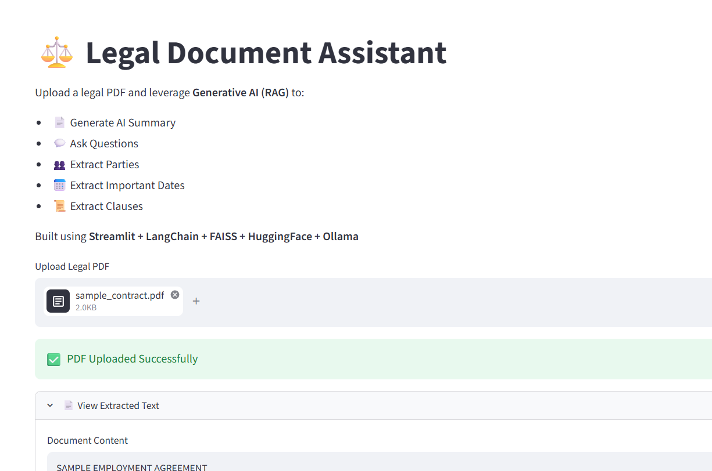

# ⚖️ Legal Document Assistant using Generative AI

## 🚀 Live Demo

🔗 **Application:** [https://YOUR-STREAMLIT-APP.streamlit.app](https://readmemd-ucz9fnofmjp3irpgfwwt4p.streamlit.app/)


## 📌 Overview

The Legal Document Assistant is a Generative AI application that enables users to upload legal PDF documents and interact with them using natural language. It uses Retrieval-Augmented Generation (RAG) to retrieve relevant document content before generating AI-powered responses.

---

## ✨ Features

- 📄 Upload Legal PDF documents
- 🤖 AI-powered document summarization
- 💬 Ask questions about uploaded documents
- 👥 Extract parties involved
- 📅 Extract important dates
- 📜 Extract legal clauses
- 🔍 Semantic search using FAISS
- ⚡ Local LLM inference using Ollama (No API Key)

---

## 🛠️ Technologies Used

- Python
- Streamlit
- LangChain
- FAISS Vector Store
- HuggingFace Embeddings
- Ollama
- Llama 3.2
- Retrieval-Augmented Generation (RAG)

---

## 📂 Project Structure

```
Legal Document Assistant-GenAI/
│── app.py
│── requirements.txt
│── README.md
│── dashboard.png
│── sample_contract.pdf
```

---

## 📸 Application Screenshot



---

## ▶️ Run Locally

```bash
pip install -r requirements.txt
streamlit run app.py
```

---

## 🧠 How It Works

1. Upload a legal PDF.
2. Extract text from the document.
3. Split the document into chunks.
4. Generate embeddings using HuggingFace.
5. Store embeddings in FAISS.
6. Retrieve relevant content using semantic search.
7. Generate answers using Llama 3.2 via Ollama.

---

## 📈 Future Enhancements

- Multiple PDF support
- Download AI summary
- Chat history
- Clause highlighting
- Confidence score
- OCR support for scanned PDFs

---

## 👩‍💻 Author

**Sushma Rakesh**

GitHub: https://github.com/sushmarakesh17
